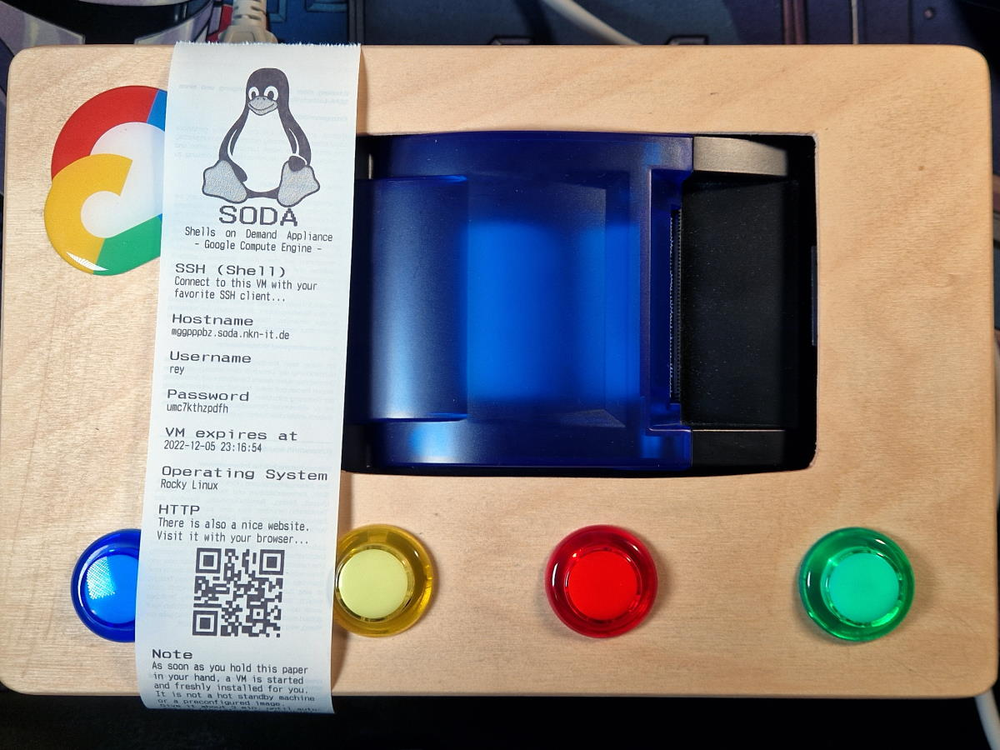

# Shells on Demand Appliance (Google Compute Engine)

**Get your own Google Compute Engine virtual machine (VM) with the simple push of a button.**

[](./img/README.md)

This project is intended to show how quickly and easily virtual machines can be configured and set up using Google Cloud and Infrastructure as Code (IaC) tools.
You have the choice between four Linux based operating systems.
You trigger a continuous integration / continuous deployment (CI/CD) pipeline by pressing a button.
A virtual machine is then provisioned and installed for you in the Google Cloud.
In the background, [Google Cloud Build](https://cloud.google.com/build) uses [Terraform](https://www.terraform.io/) and [Ansible](https://www.ansible.com/) to build your own VM.
You will get your own user login data printed on a receipt and you can log in via SSH after a few minutes.


This project also shows you how well the Google Cloud can scale.
Tested with over 100 VMs. [700 VMs](./QUOTA.md) is the default limit.

## 🤔 Why
I saw the Shells On Demand Appliance "SODA" from National Upcycled Computing Collective (NUCC) at the DEF CON 30 conference in Las Vegas. Unfortunately not in person but in this [YouTube video](https://www.youtube.com/watch?v=e69zcwISo3Y).

TL;DR: It's a vending machine. You pay, press a button and get your own virtual machine (VM).


*Image Source: [@strangepartscom](https://twitter.com/strangepartscom/status/1558566808205987840/), [@Zhoratrope](https://twitter.com/Zhoratrope/status/1558160122957799424)*

I was quite impressed and excited by the idea. I wanted something like this too. Unfortunately, I don't have enough space and I don't even have a real vending machine either.

Thanks to Google and the Internet, the hardware does not have to be physically located in a vending machine. The hardware can be located in one of the many [Google Cloud data centers](https://gcloud-compute.com/regions.html). This saves a lot of space and you only need the buttons and a thermal receipt printer to have a similar setup to the SODA vending machine. That's exactly what I did with this project.

## 🚀 Technology


The following technologies are used:

<details>
<summary><b>Google Cloud Platform</b></summary>

- [x] [Compute Engine](https://cloud.google.com/compute)
- [x] [Operating system images](https://cloud.google.com/compute/docs/images/os-details)
	- [x] Debian GNU/Linux
	- [x] Ubuntu LTS
	- [x] Rocky Linux
	- [x] openSUSE
- [x] [Cloud Storage](https://cloud.google.com/storage)
- [x] [Cloud Source Repositories](https://cloud.google.com/source-repositories)
- [x] [Cloud Pub/Sub](https://cloud.google.com/pubsub)
- [x] [Cloud Build](https://cloud.google.com/build)
	- [x] [Docker Container image](https://github.com/Cyclenerd/google-cloud-gcp-tools-container#readme)
- [x] [Cloud Function](https://cloud.google.com/functions)
- [x] [Artifact Registry](https://cloud.google.com/artifact-registry)
- [x] [Cloud DNS](https://cloud.google.com/dns)
- [x] [Cloud Firewall](https://cloud.google.com/firewalls)
- [x] [Cloud Logging and Monitoring](https://cloud.google.com/monitoring)
- [x] [Cloud Scheduler](https://cloud.google.com/scheduler)
- [x] [Identity and Access Management (IAM)](https://cloud.google.com/iam)
- [x] [Resource Manager](https://cloud.google.com/resource-manager)
</details>

<details>
<summary><b>Terraform</b></summary>

- [x] [Google provider](https://registry.terraform.io/providers/hashicorp/google/)
- [x] [Archive provider](https://registry.terraform.io/providers/hashicorp/archive/)
- [x] [Local provider](https://registry.terraform.io/providers/hashicorp/local/)
</details>

<details>
<summary><b>Ansible</b></summary>

- Built-in modules:
	- [x] apt
	- [x] command
	- [x] copy
	- [x] dnf
	- [x] file
	- [x] get_url
	- [x] git
	- [x] uri
	- [x] user
	- [x] zypper
</details>

<details>
<summary><b>Raspberry Pi</b></summary>

- [x] [Raspberry Pi OS](https://www.raspberrypi.com/software/operating-systems/)
- [x] [Python 3](https://www.python.org/)
</details>


All components put together correctly result in the Shells on Demand Appliance Google Cloud version.

## 🪄 Process of creating a VM


https://user-images.githubusercontent.com/176242/205736692-b19bca68-a94c-4e95-8c32-79a9f7dfc7a9.mp4

[📺 YouTube Video](https://www.youtube.com/watch?v=9a_9sfi7aaU)

In order to create a VM, many steps are carried out.
Everything goes very fast.
While the user is already holding his paper with login information,
further steps are executed in the cloud.

[](./img/soda-gcp.png)

**Raspberry Pi:**

1. User presses one of the four buttons
	* 🔵 Blue : Debian GNU/Linux
	* 🟡 Yellow : Ubuntu LTS
	* 🔴 Red : Rocky Linux
	* 🟢 Green : openSUSE
2. Message is published to Cloud Pub/Sub topic
3. Paper receipt with login information is printed

**Google Cloud Platform:**

3. Pub/Sub triggers Cloud Build
4. A Cloud Build job is started
	1. Cloud Build downloads [Docker container image](https://github.com/Cyclenerd/google-cloud-gcp-tools-container) with tools (Google Cloud CLI, Terraform, Ansible)
	1. Required scripts are loaded from the Cloud Source Repository
	1. Pub/Sub message is read and evaluated
5. Terraform creates the infrastructure
	* Static public IP is registered
	* DNS entry is created
	* VM with SSD disk and operating system is created
	* Cloud Scheduler to destroy infrastructure is scheduled
	* Terraform state is stored in a Google Cloud Storage bucket
6. Ansible takes care of configuring the operating system
	* Set up user (username and password)
	* Configure SSH
	* Install web server

### Machine configuration

The following configuration is used by default:

* Machine type: [`g1-small`](https://gcloud-compute.com/g1-small.html)
	* vCPU: 1 shared Intel (x86/64)
	* Memory: 1.7 GB
* Disk:
	* Type: [Balanced persistent disk](https://cloud.google.com/compute/docs/disks#disk-types) (SSD)
	* Size: 25 GB
* External IP address: Premium
* Region: [`europe-west1`](https://gcloud-compute.com/europe-west1/g1-small.html) (Belgium) 

**Costs:**

Estimated cost per `g1-small` VM, without guarantee:

|  | $ 1h | $ 3h |
|--|--|--|
| CPU and memory | `0.0285` | `0.09` |
| Disk (25GB)¹ | `0.0034` | `0.01` |
| Static public IP | `0.0034` | `0.01` |
| **Total** | `0.0353` | `0.11` |

¹ Disk: 0.1 USD per 1 GB and month,
25 GB per month = 2.50 USD,
one month = 730 hours,
2.50 USD / 730h = 0.0034 USD,
0.0034 USD * 3h = 0.010 USD for 25 GB for 3h

There are other small costs for:

* Cloud Build build time
* Source Repository users
* Cloud Scheduler jobs
* Cloud DNS managed zone
* Network Internet egress traffic

Source: [Google Cloud Pricing Calculator](https://cloud.google.com/products/calculator/#id=4ca15321-259b-46b4-9cf5-1f48b8536ec7)

## 🚀 Setup

### 1. Clone

Clone this repository:

```bash
git clone https://github.com/Cyclenerd/google-cloud-shells-on-demand.git
cd google-cloud-shells-on-demand
```
### 2. Google Cloud Platform

Please follow the instructions in the folder [gcp](./gcp/).

```bash
cd gcp
```

### 3. Raspberry Pi

Please follow the instructions in the folder [pi](./pi/).

```bash
cd pi
```

## 🔦 Further functions

In addition to creating the infrastructure, there are a few other functions.

### Automatic expiration

After a defined time (default 3 hours), your VM and its entire infrastructure will be deleted.

[](./img/destroy.png)

This is triggered by a Cloud Scheduler set up during the creation of the VM.
A Cloud Build job then takes care of the destruction of the VM and its infrastructure.
This works because an extra separate Terraform state is saved for each VM.

You can adjust the expiration time (minutes) in `terraform.tfvars` in the `gcp` directory.

```text
# Expires in minutes
expires = "180"
```

### Back on

After logging in to your VM via SSH, you can become root.
Then you can do anything, even shut down the VM:

```bash
sudo poweroff
```

[](./img/on-again.png)

If you do this, a event will be saved in the Google Cloud audit log and a new Cloud Build job will be triggered.

This Cloud Build job then starts your VM again. Feel free to test it 😊.

### Cloud Build notifications

Get notified via [Discord](https://discord.com/) when a Cloud Build job is failed (`ERROR`) or timed out (`TIMEOUT`).

[](./img/cloudbuild-discord.png)

1. Create an Discord webhook URL for your Discord channel: <https://support.discord.com/hc/en-us/articles/228383668-Intro-to-Webhooks>
	
	The webhook URL should look similar to the following:
	```text
	https://discord.com/api/webhooks/[WEBHOOK-ID]/[WEBHOOK-TOKEN]
	```
1. Add the Discord webhook URL to `terraform.tfvars` in `gcp` directory:
	
	```text
	# Discord webhook URL
	discord-webhook-url = "https://discord.com/api/webhooks/[WEBHOOK-ID]/[WEBHOOK-TOKEN]"
	```
1. Deploy Cloud Function
	
	```bash
	terraform apply
	```

You can test the notification with the manual trigger `simulate-error`.

### Artifact Registry repository

You can use the Artifact Registry as a location for the Docker container image.
The image then does not have to be downloaded from Docker Hub during the Cloud Build jobs.

[](./img/copy-image.png)

1. Copy the image by running the manual trigger `copy-image`.
1. Replace `cyclenerd/google-cloud-gcp-tools-container:latest` with `[LOCATION]-docker.pkg.dev/[PROJECT_ID]/cointainer/google-cloud-gcp-tools-container:latest` in `cloudbuild` YAML files.
1. Push changes to Cloud Source repository:
	```bash
	git push cloudsource
	```


## ❤️ Contributing

Have a patch that will benefit this project?
Awesome! Follow these steps to have it accepted.

1. Please read [how to contribute](CONTRIBUTING.md).
1. Fork this Git repository and make your changes.
1. Create a Pull Request.
1. Incorporate review feedback to your changes.
1. Accepted!


## 📜 License

All files in this repository are under the [Apache License, Version 2.0](LICENSE) unless noted otherwise.

Please note:

* No warranty
* No official Google product