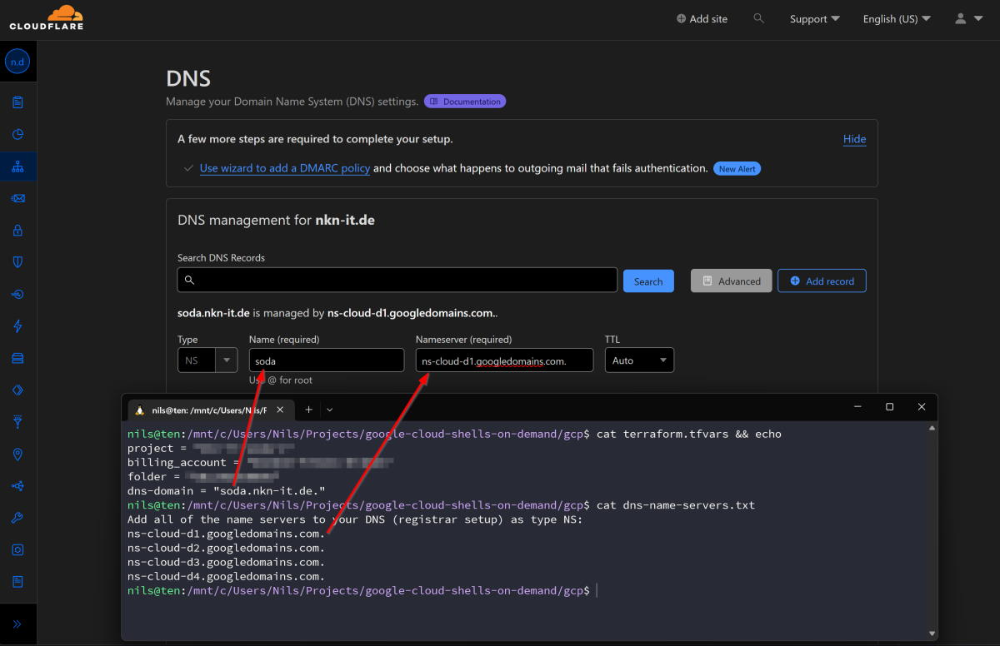
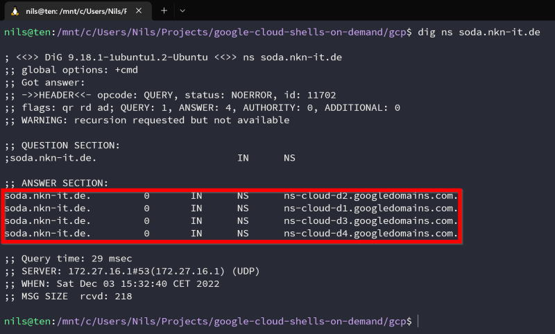
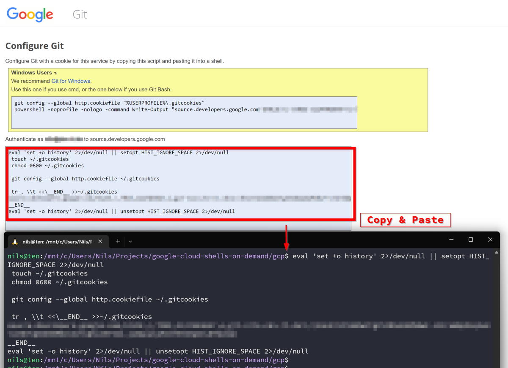

# Google Cloud Platform

A separate and dedicated Google Cloud project is created and set up.

> **Note**
> Do not use a project that has already been created.
> Terraform creates a new project for us.

## Configuration

Create variable file `terraform.tfvars`:

```text
# Google Cloud project ID
# Changing this forces a new project to be created
project = "[PROJECT_ID]"

# The alphanumeric ID of the billing account this project belongs to
billing_account = "[BILLING_ACCOUNT_ID]"

# The numeric ID of the folder this project should be created under
folder = "[FOLDER_ID]"

# Google Cloud DNS domain name suffix for managed zone
# This domain is used for the VMs
# Name field must end with trailing dot, for example myzone.example.com. (note the trailing dot)
dns-domain = "subdomain.domain.tld."
```

Please verify the ownership of the domain (or a parent) at <http://www.google.com/webmasters/verification/>.

## Create Project

### Authentication

1. To initiate authorization, enter the following command:

	```bash
	gcloud auth application-default login --no-launch-browser
	```

1. Copy the long URL that begins with `https://accounts.google.com/o/oauth2/auth...`
1. Paste this URL into the browser with which you are currently logged in with your admin account.
1. Copy the authorization code from the web browser.
1. Paste the authorization code back to the prompt,
   "Enter authorization code", and press Enter to complete the authorization.

### Set quota project

```bash
gcloud auth application-default set-quota-project [EXISTING-GOOGLE-PROJECT]
```

### Initialize
	
```bash
terraform init
```

### Apply

```bash
terraform apply
```

### Copy

Copy `variables.sh` and `pi-private-key.json` to `pi` directory:

	```bash
	cp variables.sh ../pi/
	cp pi-private-key.json ../pi/
	```

## DNS

Add all name servers from file `dns-name-servers.txt` to your DNS (registrar setup) as type NS.

```bash
cat dns-name-servers.txt
```

Example of configuration with Cloudflare DNS management and domain name (`dns-domain`) suffix `soda.nkn-it.de.`:



Repeat with all four DNS servers.

Test:

```bash
dig ns soda.nkn-it.de
```



## Cloud Source

Copy this repo to Google Cloud Source.

1. [Generate and store your Git credentials](https://source.developers.google.com/auth/start?scopes=https://www.googleapis.com/auth/cloud-platform&state=1)

	

1. Add Cloud Source repository as remote repo:
	
	```bash
	bash sourcerepo-url.sh
	```
1. Push:

	```bash
	git push cloudsource
	```

1. View repository:

	<https://source.cloud.google.com/repos>

If you want to log out again, follow these steps: [Revoke cookies](https://www.google.com/accounts/IssuedAuthSubTokens)

## Custom OS images

After pushing this repo to Google Cloud Source, a Google Cloud Build is triggered that creates the custom OS images.


List OS images:

```bash
gcloud compute images list \
--no-standard-images \
--project [YOUR-GOOGLE-CLOUD-PROJECT]
```

Output:

```text
NAME           FAMILY           STATUS
custom-debian  debian-12        READY
custom-fedora  fedora-cloud-38  READY
custom-suse    opensuse-leap    READY
custom-ubuntu  ubuntu-2204-lts  READY
```

## Done

Your Google Cloud Platform is now configured. Continue with the [Raspberry Pi](../pi/README.md).

```bash
cd ../pi/
```

## Reset

If you want to delete everything, Terraform can destroy everything for you:

```bash
terraform apply -destroy
rm -rf .terraform .terraform.lock.hcl terraform.tfstate
```

Because everything is set up in an extra project, you can also just delete the whole project.