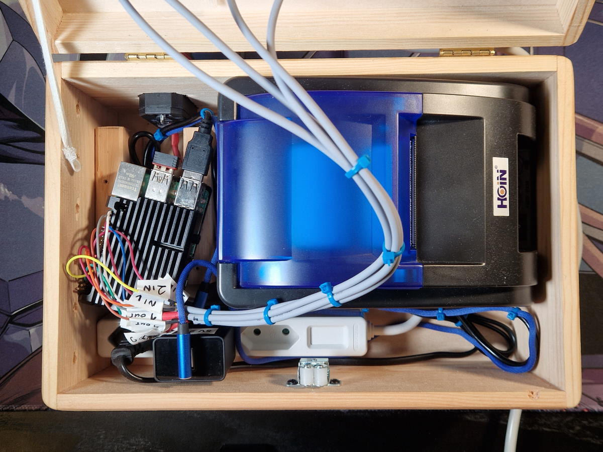
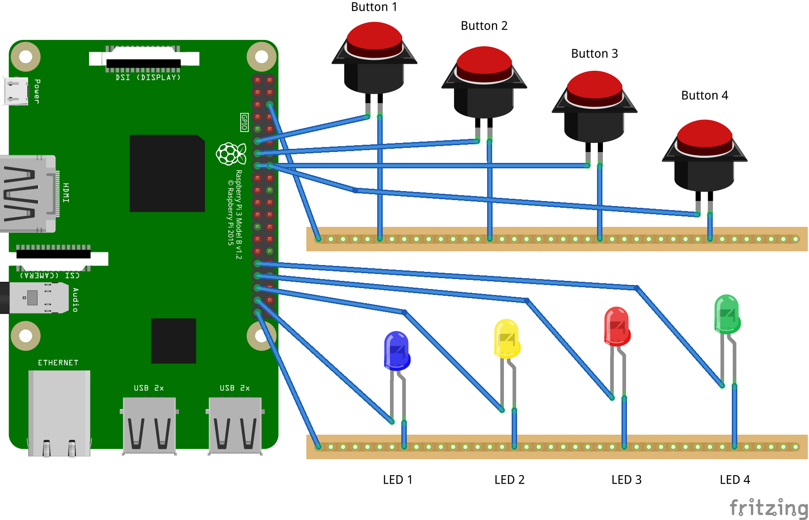
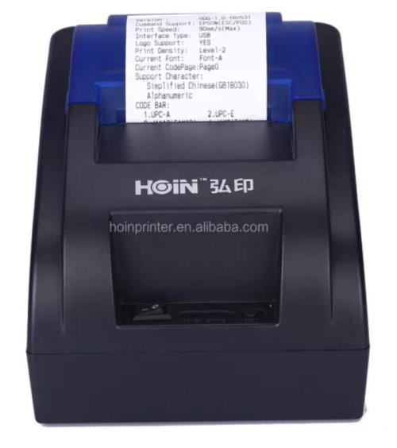

# Raspberry Pi

A Raspberry Pi is used to send the command to create a VM after a button is pressed.

> **Note**
> I am using a Raspberry Pi 4 with Raspberry Pi OS Lite (64-bit) based on Debian version 11 (bullseye).
> An older Raspberry Pi 3 with 64-bit Linux should also work.



## Operating System

1. [Download](https://www.raspberrypi.com/software/operating-systems/#raspberry-pi-os-64-bit) Raspberry Pi OS Lite (64-bit) (not with desktop).
1. [Install](https://www.raspberrypi.com/documentation/computers/getting-started.html#installing-the-operating-system) the operating system image to your micro SD card
1. [Run](https://www.raspberrypi.com/documentation/computers/getting-started.html#configuration-on-first-boot) the configuration wizard on the first boot
	* Set your username to the old default username `pi` with a strong password
	* Set up your network
1. [Enable SSH](https://www.raspberrypi.com/documentation/computers/remote-access.html#enabling-the-server) Server for remote access
	1. Enter `sudo raspi-config`
	1. Select `Interfacing Options`
	1. Navigate to and select `SSH`
	1. Choose `Yes`
	1. Select `Ok`
	1. Choose `Finish`
1. Reboot

[Connect](https://www.raspberrypi.com/documentation/computers/remote-access.html#secure-shell-from-linux-or-mac-os) via SSH to your Raspberry Pi.

```bash
ssh pi@[RASPBERRY_PI_IP]
```

## Wiring

Wire the arcade buttons to the Raspberry Pi.

> I am using the [EG STARTS 30mm Arcade LED Buttons](https://www.amazon.de/dp/B01N11BDX9/) from Amazon.de.
> They are designed for 5V, but they also work great with 3.3V from the Raspberry Pi.

Raspberry Pi GPIO pinout:

<!--
  Markdown table with Raspberry Pi GPIO pinout
  https://github.com/Cyclenerd/raspberry-pi-gpio-pinout-markdown
-->
|                   |           | PIN  |      |      | PIN  |          |                  |
|-------------------|-----------|------|------|------|------|----------|------------------|
|                   | 3v3 Power | `1`  |  🟧  |  🔴  | `2`  | 5v Power |                  |
|                   | GPIO 2    | `3`  |  🔵  |  🔴  | `4`  | 5v Power |                  |
|                   | GPIO 3    | `5`  |  🔵  | [⚫] | `6`  | *Ground* | *Button Ground*  |
|                   | GPIO 4    | `7`  |  🟢  |  🟣  | `8`  | GPIO 14  |                  |
|                   | *Ground*  | `9`  |  ⚫  |  🟣  | `10` | GPIO 15  |                  |
| Button 1 (Blue)   | GPIO 17   | `11` | [🟢] |  🟤  | `12` | GPIO 18  |                  |
| Button 2 (Yellow) | GPIO 27   | `13` | [🟢] |  ⚫  | `14` | *Ground* |                  |
| Button 3 (Red)    | GPIO 22   | `15` | [🟢] | [🟢] | `16` | GPIO 23  | Button 4 (Green) |
|                   | 3v3 Power | `17` |  🟠  |  🟢  | `18` | GPIO 24  |                  |
|                   | GPIO 10   | `19` |  🟡  |  ⚫  | `20` | *Ground* |                  |
|                   | GPIO 9    | `21` |  🟡  |  🟢  | `22` | GPIO 25  |                  |
|                   | GPIO 11   | `23` |  🟡  |  🟡  | `24` | GPIO 8   |                  |
|                   | *Ground*  | `25` |  ⚫  |  🟡  | `26` | GPIO 7   |                  |
|                   | GPIO 0    | `27` |  🔵  |  🔵  | `28` | GPIO 1   |                  |
|                   | GPIO 5    | `29` |  🟢  |  ⚫  | `30` | *Ground* |                  |
| LED 4 (Green)     | GPIO 6    | `31` | [🟢] |  🟢  | `32` | GPIO 12  |                  |
| LED 3 (Red)       | GPIO 13   | `33` | [🟢] |  ⚫  | `34` | *Ground* |                  |
| LED 2 (Yellow)    | GPIO 19   | `35` | [🟤] |  🟢  | `36` | GPIO 16  |                  |
| LED 1 (Blue)      | GPIO 26   | `37` | [🟢] |  🟤  | `38` | GPIO 20  |                  |
| *LED Ground*      | *Ground*  | `39` | [⚫] |  🟤  | `40` | GPIO 21  |                  |




RPi.GPIO:
```python
# LEDs
blue   = LED(26)
yellow = LED(19)
red    = LED(13)
green  = LED(6)

# Buttons
b1 = Button(17)
b2 = Button(27)
b3 = Button(22)
b4 = Button(23)
```

## Printer

Connect the thermal receipt printer via USB to the Raspberry Pi.

> I am using the [Hoin HOP-H58](https://www.hoinprinter.com/video/products-detail-906853) from eBay.
> Any printer that supports ESC/POS commands should work.




## Software

Copy the required scripts and programs to turn the Raspberry Pi into the "Shells on Demand Appliance".

> ** Warning **
> Perform these steps only after you have set up Google Cloud Platform as described in the [gcp](../gcp/) folder.

This is also automated. Run the following [Ansible playbook](./pi-soda.yml):

```bash
ansible-playbook "pi-soda.yml" \
-u "pi" \
-i [RASPBERRY_PI_IP],
```

> 💁 Do not forget the comma (`,`) after the IP.

This is what the command looks like with my local IP from the Raspberry Pi:
```bash
ansible-playbook "pi-soda.yml" -u "pi" -i 192.168.100.155,
```

After Ansible has setup everything log in via SSH and do a reboot:

```bash
sudo reboot
```

## SODA

After a minute uptime, a script (`start.sh`) starts automatically in the background.
The script waits for the button input and sends a message via Pub/Sub.

Enter `soda` to get the script it in the foreground.

Use key combination <kbd>Ctrl</kbd> + <kbd>d</kbd> to get back to the normal terminal.

## Network

The network configuration is always configured via DHCP.

A fallback is configured for the LAN interface (`eth0`):

Static LAN IPv4: `100.100.100.100`

> 🤓 This is a IP from the for [carrier-grade NAT ](https://en.wikipedia.org/wiki/Carrier-grade_NAT) allocated address block.

Optionally, the Raspberry Pi can also act as an access Wi-Fi access point.
You need a second Wi-Fi interface (`wlan1`) for this and then you can connect to the Wi-Fi (name: `Shells on Demand Appliance`) and then access the Raspbery Pi via SSH.

> I am using the [HOMESPOT Wireless USB Adapter](https://www.amazon.de/dp/B01ERHE18S/) (with Realtek `RTL8188CUS` chip) from Amazon.de as second Wi-Fi adapter.

Static Wi-Fi access point IPv4: `100.100.200.200`

To enable the access point set the variable `wpa_passphrase` with a passphrase for the Wi-Fi:

```bash
ansible-playbook "pi-soda.yml" \
-u "pi" \
-e "wpa_passphrase=[WPA_PASSPHRASE]" \
-i [RASPBERRY_PI_IP],
```

The passcode must be at least 8 characters and at maximum 63 characters long.

More help: <https://www.raspberrypi.com/documentation/computers/configuration.html#setting-up-a-routed-wireless-access-point>

## Image

The Linux mascot [Tux](https://en.wikipedia.org/wiki/Tux_(mascot)) is printed on the receipt.
The original image by [gg3po](https://commons.wikimedia.org/wiki/File:TuxFlat.svg) was converted to black and white:


Image source: <https://commons.wikimedia.org/wiki/File:TuxFlat.svg>

Image permission:

> This work is [free software](https://en.wikipedia.org/wiki/en:Free_software);
> you can redistribute it and/or modify it under the terms of the [GNU General Public License](https://en.wikipedia.org/wiki/en:GNU_General_Public_License)
> as published by the [Free Software Foundation](https://en.wikipedia.org/wiki/en:Free_Software_Foundation);
> either version 2 of the License, or any later version.
> This work is distributed in the hope that it will be useful,
> but without any warranty; without even the implied warranty of merchantability or fitness for a particular purpose.
> See [version 2](https://www.gnu.org/licenses/old-licenses/gpl-2.0.html) and [version 3 of the GNU General Public License](https://www.gnu.org/copyleft/gpl-3.0.html) for more details.

You can replace the image by changing the `image.png` file and running the Ansible playbook again.